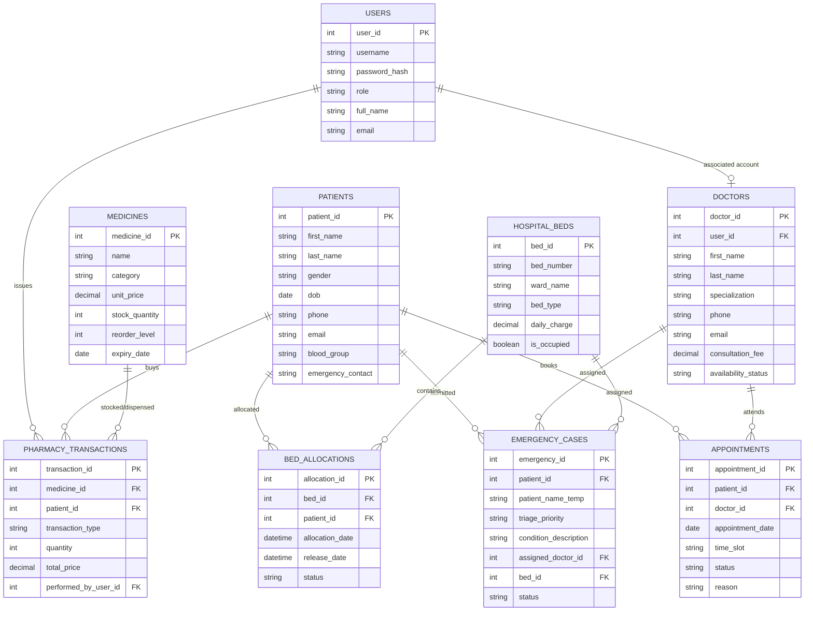

# Entity-Relationship Diagram

```mermaid
erDiagram
    USERS {
        int user_id PK
        string username
        string password_hash
        string role
        string full_name
        string email
    }

    PATIENTS {
        int patient_id PK
        string first_name
        string last_name
        string gender
        date dob
        string phone
        string email
        string blood_group
        string emergency_contact
    }

    DOCTORS {
        int doctor_id PK
        int user_id FK
        string first_name
        string last_name
        string specialization
        string phone
        string email
        decimal consultation_fee
        string availability_status
    }

    APPOINTMENTS {
        int appointment_id PK
        int patient_id FK
        int doctor_id FK
        date appointment_date
        string time_slot
        string status
        string reason
    }

    HOSPITAL_BEDS {
        int bed_id PK
        string bed_number
        string ward_name
        string bed_type
        decimal daily_charge
        boolean is_occupied
    }

    BED_ALLOCATIONS {
        int allocation_id PK
        int bed_id FK
        int patient_id FK
        datetime allocation_date
        datetime release_date
        string status
    }

    EMERGENCY_CASES {
        int emergency_id PK
        int patient_id FK
        string patient_name_temp
        string triage_priority
        string condition_description
        int assigned_doctor_id FK
        int bed_id FK
        string status
    }

    MEDICINES {
        int medicine_id PK
        string name
        string category
        decimal unit_price
        int stock_quantity
        int reorder_level
        date expiry_date
    }

    PHARMACY_TRANSACTIONS {
        int transaction_id PK
        int medicine_id FK
        int patient_id FK
        string transaction_type
        int quantity
        decimal total_price
        int performed_by_user_id FK
    }

    USERS ||--o| DOCTORS : "associated account"
    USERS ||--o{ PHARMACY_TRANSACTIONS : "issues"
    PATIENTS ||--o{ APPOINTMENTS : "books"
    PATIENTS ||--o{ BED_ALLOCATIONS : "allocated"
    PATIENTS ||--o{ EMERGENCY_CASES : "admitted"
    PATIENTS ||--o{ PHARMACY_TRANSACTIONS : "buys"
    DOCTORS ||--o{ APPOINTMENTS : "attends"
    DOCTORS ||--o{ EMERGENCY_CASES : "assigned"
    HOSPITAL_BEDS ||--o{ BED_ALLOCATIONS : "contains"
    HOSPITAL_BEDS ||--o{ EMERGENCY_CASES : "assigned"
    MEDICINES ||--o{ PHARMACY_TRANSACTIONS : "stocked/dispensed"
```
